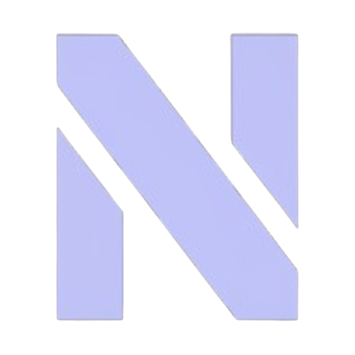

# NexusWeb  

> ✨ **Nexus.** Deja de buscar, empieza a encontrar. ✨

---

  

**NexusWeb** es el sitio web oficial de documentación y presentación del ambicioso proyecto **Nexus**. Esta plataforma digital estática ha sido meticulosamente diseñada para detallar la planificación exhaustiva, la arquitectura técnica y el estudio de viabilidad de la aplicación Nexus, una solución innovadora que promete revolucionar la forma en que los usuarios acceden a ofertas de productos nuevos y exploran el vibrante mercado de segunda mano.

Este repositorio es el hogar del código fuente de `nexus-app.es`, nuestra ventana al mundo del proyecto Nexus.

---

## 💡 ¿Qué es Nexus (El Proyecto)?

Nexus no es solo una aplicación; es una **visión** para unificar un mercado fragmentado y empoderar al usuario en su búsqueda de valor. Nuestro objetivo es crear una experiencia fluida y potente donde los usuarios puedan:

* 🌐 **Descubrir Ofertas Únicas:** Accede a un universo de productos nuevos en oferta, seleccionados por la comunidad y publicados directamente por empresas colaboradoras.
* ♻️ **Explorar Segunda Mano:** Navega por un dinámico mercado de artículos usados, directamente de otros particulares.
* 🔍 **Búsqueda Unificada e Inteligente:** Un potente buscador global que integra resultados de productos nuevos y de segunda mano, ofreciendo una comparativa transparente e inteligente.
* 💖 **Interacción Comunitaria:** Valora el contenido con 'Likes' y 'Comentarios', y organiza tus descubrimientos en 'Listas de Favoritos'.
* 🚀 **Publicación Intuitiva:** Vende tus propios artículos de segunda mano o comparte ofertas de productos nuevos con total facilidad.

---

## 🛠️ Tecnologías Empleadas

El proyecto Nexus es una ambiciosa empresa de desarrollo que abarca múltiples plataformas y tecnologías de vanguardia.

### 📱 Stack Tecnológico de la App Nexus (Proyecto Principal)

| Componente       | Tecnología Principal | Detalles Adicionales                                       |
| :--------------- | :------------------- | :--------------------------------------------------------- |
| **Backend** | Java Spring Boot     | API RESTful, lógica de negocio, seguridad.                  |
| **Base de Datos**| PostgreSQL           | Base de datos relacional robusta para datos de usuario y producto. |
| **Frontend Web** | Angular              | Aplicación web progresiva (PWA) para acceso desde navegador. |
| **Frontend Android**| Java (Android Studio) | Desarrollo nativo para la plataforma Android.                |
| **Frontend iOS** | Swift                | Desarrollo nativo y optimizado para el ecosistema Apple.    |

### 🌐 Stack Tecnológico de este Sitio Web (NexusWeb)

Nuestro sitio de documentación (`NexusWeb`) ha sido construido con las siguientes tecnologías para asegurar una presentación impecable y una experiencia de usuario fluida:

* **Estructura:** **HTML5 Semántico** para una estructura de contenido clara y accesible.
* **Estilos:** **CSS3 Puro**, con un enfoque en diseño "dark mode" elegante, tipografía de sistema (`Inter`, `system-ui`) y nuestro distintivo degradado de marca.
* **Animaciones:** **GSAP (GreenSock Animation Platform)** para transiciones suaves y efectos visuales atractivos.
* **Iconografía:** **Simple Icons** para integrar logos de plataformas y servicios de manera eficiente.
* **Despliegue:** Preparado para hosting estático (GitHub Pages, Vercel, Netlify), accesible desde `nexus-app.es`.

---

## 📁 Estructura del Repositorio (NexusWeb)

Una visión detallada de cómo se organiza nuestro proyecto de documentación:

* `index.html`: La vibrante página de inicio o "Landing Page", diseñada para captar la atención y presentar la esencia de Nexus.
* `moreinfo.html`: El hub principal de navegación hacia todas las secciones de documentación, incluyendo el acceso al formulario de contacto.
* `project-plan.html`: Contiene el documento detallado del Plan de Proyecto, abarcando fases, cronograma (Nov 2025 - May 2026) y estrategias de gestión.
* `viability-study.html`: El exhaustivo Estudio de Viabilidad, cubriendo aspectos técnicos, económicos y legales para asegurar el éxito del proyecto.
* `requirements.html`: La especificación completa de los Requisitos Funcionales (RF) y No Funcionales (RNF) que guían el desarrollo de la aplicación.
* `document-uml.html`: Una explicación profunda y visual de nuestro Diagrama de Clases UML, clave para entender la arquitectura de la app.
* `/assets/`:
    * `UML.png`: La representación gráfica del Diagrama de Clases UML.
    * `logo.png`: El distintivo logo "N" de Nexus.
* `/styles/`:
    * `inicio-styles.css`: Estilos específicos para la página de inicio.
    * `moreinfo-styles.css`: Estilos para el resto de las páginas informativas.
* `/script/`:
    * `script.js`: Funcionalidades JavaScript generales para el sitio.
    * `animations.js`: Scripts dedicados a las animaciones GSAP.
* `CNAME`: Archivo de configuración para el dominio personalizado `nexus-app.es`.

---

## 👨‍💻 Autores del Proyecto Nexus

Este ambicioso proyecto ha sido conceptualizado, diseñado y documentado por un equipo apasionado:

* **Rafa Lázaro**
* **José Manuel Jiménez**
* **Juan José Gamero**

---
